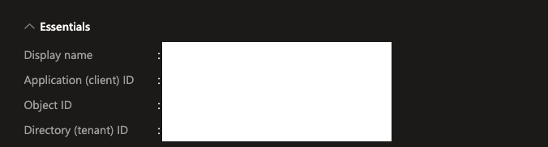
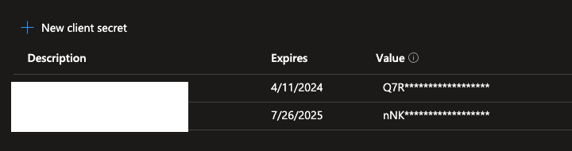

# Provision a Service Principal, Generate the SP Token, Update the Token to Downstream Applications

Based on the Databricks webpage titled "[Service Principals for CI/CD](https://docs.databricks.com/dev-tools/ci-cd/ci-cd-sp.html)," using a Service Principal (SP) for CI/CD is considered a best practice. There are five steps in  "[Provision a service principal for Azure Databricks automation - Azure Databricks UI](https://learn.microsoft.com/en-us/azure/databricks/dev-tools/service-principals)" to create an Azure SP, add the SP to Azure Databricks account and workspace, assign workspace-level permissions to the SP, and generate Azure AD token for the SP. This document follows the aforementioned five steps to create and setp the SP, but using the 'curl' command to generate the SP's token and python scripts to renew the SP's token and update the token in downstream application for automation. 

Without further ado, let's get started.

## 1. Create a Service Principal (SP) with a Secret in Azure Active Directory
Follow the first step, [Step 1: Create an Azure service principal in your Azure account](https://learn.microsoft.com/en-us/azure/databricks/dev-tools/service-principals#step-1-create-an-azure-service-principal-in-your-azure-account), to create an SP and a secret. After successfully creating the SP and secret, you should obtain the following information:
- Application ID
- Tenant ID
- Client ID
- Client secret

Note: Please refer to the following App registration of Azure Active Directory (AAD) screenshots for the above information:



## 2. Add the SP to Azure Databricks Account and Workspace
Continue with steps 2 and 3, [Step 2: Add the Azure service principal to your Azure Databricks account](https://learn.microsoft.com/en-us/azure/databricks/dev-tools/service-principals#step-2-add-the-azure-service-principal-to-your-azure-databricks-account) and [Step 3: Add the Azure service principal to your Azure Databricks workspace](https://learn.microsoft.com/en-us/azure/databricks/dev-tools/service-principals#step-3-add-the-azure-service-principal-to-your-azure-databricks-workspace), to add the SP to Azure Databricks account and workspace. 

Note: If your workspace is not Unity Catalog enabled, you can just assign the SP to the workspace and skip the account setup.

## 3. Assign Workspace-Level Permissions
Complete step 4, [Step 4: Assign workspace-level permissions to the Azure AD service principal](https://learn.microsoft.com/en-us/azure/databricks/dev-tools/service-principals#step-4-assign-workspace-level-permissions-to-the-azure-ad-service-principal), to assign the appropriate workspace-level permssions to the SP. 

## 4. Generate SP Token
Once we have the Tenant ID, Client ID, and Client secret, we can use the 'curl' command from the webpage title "[Generate AAD token for service principal](https://learn.microsoft.com/en-us/azure/databricks/dev-tools/service-prin-aad-token#--get-an-azure-ad-access-token-with-the-microsoft-identity-platform-rest-api)" to generate the SP token. For better readiablilty, we can have the [jq](https://jqlang.github.io/jq/) utilitity for format the output.
```bash
curl -X POST -H 'Content-Type: application/x-www-form-urlencoded' \
https://login.microsoftonline.com/<tenant-id>/oauth2/v2.0/token \
-d 'client_id=<client-id>' \
-d 'grant_type=client_credentials' \
-d 'scope=2ff814a6-3304-4ab8-85cb-cd0e6f879c1d%2F.default' \
-d 'client_secret=<client-secret>' | jq .
```
Example Output:
```
{
  "token_type": "Bearer",
  "expires_in": 3599,
  "ext_expires_in": 3599,
  "access_token": "<SP Token>"
}
```
Note: The token is valid for one hour and can be extended for an additional hour during the operation to provide support for resiliency.

## 5. Configuring Databricks CLI Authentication for SP
Please refer to the webpages titled "[Databricks CLI (legacy)](https://docs.databricks.com/en/archive/dev-tools/cli/index.html)" for instructions on configuring Databricks CLI authentication for the SP.

## 6. Automate SP Token Renewal and Downstream Application Updates
The SP's token expires in an hour; hence, you need to update the Github secret and your laptop Databricks' profile for development. Renewing the token and updating the downstream applications manually is tedious and error-prone, so we can use the following Python scripts to automate the process.

In order to run the Python scripts below, you need to install the following packages:
```
pip install requests
pip install PyGithub
```

### Renew SP Token
```
import requests

def get_access_token():
    url = f'https://login.microsoftonline.com/{tenant_id}/oauth2/v2.0/token'
    data = {
        'client_id': client_id,
        'grant_type': 'client_credentials',
        'scope': '2ff814a6-3304-4ab8-85cb-cd0e6f879c1d/.default',
        'client_secret': client_secret
    }

    headers = {
        'Content-Type': 'application/x-www-form-urlencoded'
    }

    response = requests.post(url, data=data, headers=headers)

    if response.status_code == 200:
        access_token = response.json()['access_token']
        return access_token
    else:
        print(f"Failed to get access token. Status code: {response.status_code}")
        return None

if __name__ == '__main__':
    tenant_id = '<Tenant ID>'
    client_id = '<Client ID>'
    client_secret = '<Client secret>'
    access_token = get_access_token()
    if access_token:
        print("Access Token:", access_token)
```

### Update Github Repository's Secret
```
from github import Github
import os

def update_git_secret(access_token, repository_name, secret_name, secret_value):  
    g = Github(access_token)
    repo = g.get_repo(repository_name)
    repo.delete_secret(secret_name)
    repo.create_secret(secret_name, secret_value)
    
# Call update secret function
git_access_token = "<git_access_token>"
repository_name = "git_owner/git_repo"
secret_name = "DATABRICKS_TOKEN"
secret_value = access_token

update_git_secret(git_access_token, repository_name, secret_name, secret_value)
```
Note: 
- git_access_token: refer to [Managing your personal access tokens](https://docs.github.com/en/authentication/keeping-your-account-and-data-secure/managing-your-personal-access-tokens) to generate a git personal access token (PAT).
- git_owner: the account owner of the repository, for example: charles138
- git_repo: the name of the repository without the .git extension, for example: dbx-demo-test. 
- secret_name: assumed the Github secret's name is DATABRICKS_TOKEN. 

### Update Databricks Profile 
```
def replace_token_in_databrickscfg_file(file_path, section_name, new_token):
    with open(file_path, 'r') as file:
        lines = file.readlines()

    in_target_section = False

    with open(file_path, 'w') as file:
        for line in lines:
            if line.strip().startswith(f"[{section_name}]"):
                in_target_section = True
                file.write(line)
                continue
            elif line.strip().startswith("["):
                in_target_section = False

            if in_target_section and line.strip().startswith("token"):
                file.write(f"token = {new_token}\n")
            else:
                file.write(line)


file_path = "/Users/<user_name>/.databrickscfg"
section_name = "charming-aurora"
new_token = access_token

replace_token_in_databrickscfg_file(file_path, section_name, new_token)
```
Note: 
- user_name: your username in your laptop.
- section_name: assumed the Databricks profile name is charming-aurora. 

## 7. Create a Git Credential Entry for SP
If you have the Postman application, you can refer to the document titled "[Create a Git credential entry](https://redocly.github.io/redoc/?url=https://learn.microsoft.com/azure/databricks/_static/api-refs/gitcredentials-2.0-azure.yaml#operation/create-git-credential)" to create a Git credential entry in Databricks. The left panel of the document lists actions for Get, Delete, and Update. If you wish to execute these commands, you can refer to the respective documents.

Now, we are going to run the REST API command in Python:
```
####========================================================
### Setup SP Git Integration in Databricks
####========================================================
import requests

# variables
bearer_token = "access_token"
workspace_url = "<workspace_url>"
personal_access_token = "<git_access_token>"
git_username = "<git_username>"

# Endpoint URL
url = f"{workspace_url}/api/2.0/git-credentials"
# Headers
headers = {
    "Content-Type": "application/json",
    "Authorization": f"Bearer {bearer_token}"
}
# Data to be sent in the request
data = {
    "personal_access_token": personal_access_token,
    "git_username": git_username,
    "git_provider": "gitHub"
}
try:
    # Make the POST request
    response = requests.post(url, headers=headers, json=data)
    # Check the response status code
    if response.status_code == 200:
        print("Request succeeded!")
    else:
        print(f"Request failed with status code: {response.status_code}")
        print("Response content:")
        print(response.text)
except requests.exceptions.RequestException as e:
    print(f"An error occurred: {e}")
```
Note:
- bearer_token: access_token from Step 6.
- workspace_url: workspace_url from Step 5.
- personal_access_token: git_access_token from Step 6.
- git_username: it's the git username, for example: charles138@gmail.com.
